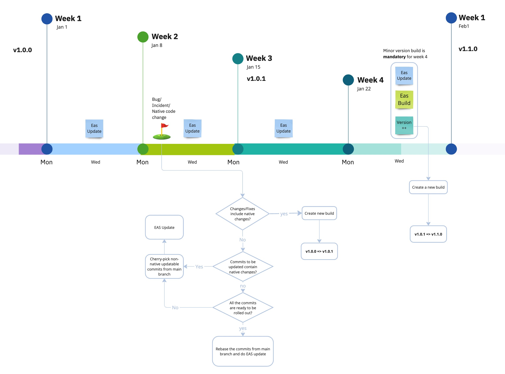

# Deployment workflow of PAPP

## Procedure

### Actions in Weekly EAS Update

#### Purpose:

- Currently we are still updating v1.0.9 when the latest app version has already been v1.0.11. When we roll out more version, we should consider when to give up the old versions, otherwise, we will have many efforts when doing EAS update.

#### Actions:

1. Review the app version usages in ios and android before the weekly EAS update

   #### iOS: [Link to App Store Connect](https://appstoreconnect.apple.com/analytics/app/d30/6541761017/metrics?chartType=singleaxis&groupDimensionKey=appVersion&measureKey=activeDevices&zoomType=day)

   #### Android

   1. Go to Google's Play Console
   2. Click User > Installed Audience > All Users 
   3. Click View by > App Version 

2. If the active users of an old version is only around 5% of the the active users of all versions, this version can be omitted for any updates.
3. Put our force update version higher than the omitted one such that in case these 5% user try to use the app, they will be forced to download the latest version instead of facing issue using the app.

   - We will start from v1.0.9
   - Consider that we plan to omit the version below 1.0.9, we should set force update min version to 1.0.9
     - It means that user can still stay at 1.0.9 but need to update the app if 1.0.8 or below

4. Announce this decision in the channel to let everyone aware on it.

### Implementation Plan:

Start date: 2/12/2024 (Monday)
Responsible person: On-duty person
Workflow review date: Dec 23 (Monday of Week 4)
