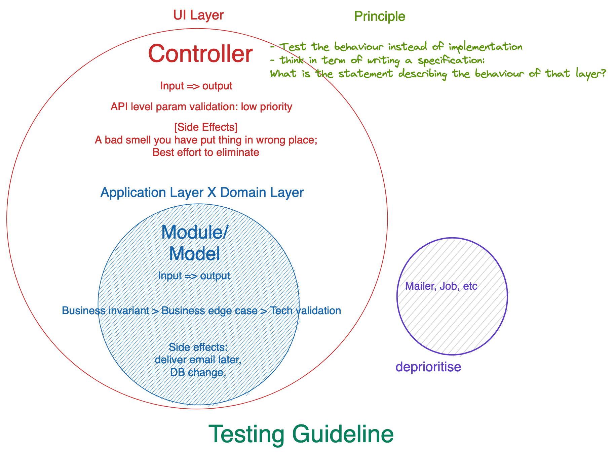

# Backend Coding Standard Draft

## Coding style
- function should be stateless, pure
- function should not have side effect, i.e. interact with the environment outside the function, causing mutatation with other things that is not expected to change
- prevent using instance variables
- always name function / method with what(the behaviour) instead of how (the implementation).
- always use simpliest basic representation for route (not using resources, only: create etc...)
  - e.g. perfer `GET /users/something/:id` instead of 
    ```
      resources :users, only: [] do
        collection do
          get ":something", to: "users#view_profile"
        end
      end
    ```
  - reason: avoid using magic provided from rails / ruby

## Modules
- idea: consider `thin model, thin controller, fat service / modules`
- entry point only for controllers / modules, but not for model
  - reason: no recursive dependency
- module / module function name should be describing the business action instead of implementation detail
  - e.g. prefer `consume_discount_code` to `decrease_discount_code_quota_by_one`
- encapsulation of business actions
- include `singleton`
- command only, query no need to be here
  - command query separation, grouping commands with similiar business domain together for easy changing business behavior
- grouping with aggregate root
  - `fulfill_order` and `create_order` should be under `order` domain
- loose function-data coupling
  - e.g. input id instead of the object itself to the function, then query by id inside the function

## Controller
- No business logic inside, business logic should be put in modules

## Services
- idea: for 3rd party only

## Test case
- idea: consider not just testing for error, but also writing a spec for the components. e.g.: what is the expected functionality / behaviour.
- testing input / output
- No testing side effect
- No testing implementation details


## Serializers
- idea: consider it as a view, any logic should be handled in controller level.
- no data query in serializer
  - reason: it may causing n + 1 query

## API design
- `data.code` is for FE to handle error case in codebase when validation cannot be checked in FE.
  - e.g. may need a `code`: `username_is_used` for duplicated `username` in db. 
- Api Design Rule: https://docs.google.com/document/d/1ytcxlOT8cvCK0Y6dApq-KXuI7XhA6cQ18xLPDOxzHFE/edit?pli=1#
- Internal API HTTP Error Status Code Guideline: https://docs.google.com/spreadsheets/d/1TAqTNE4NY-rOdOmDG4Z4Ad6fmvuwUDwCeiO5A8ztiAQ/edit#gid=0
