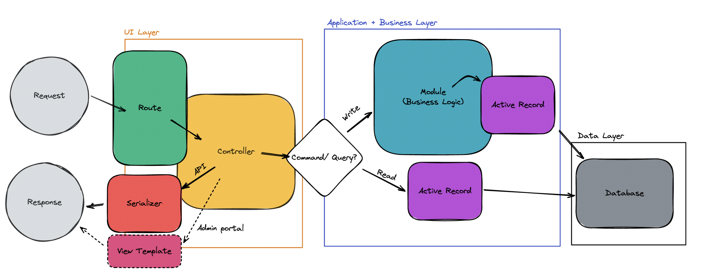

# Folder Structure Overview
# Description
This file aims to give a full picture of how BE handling request. Hopefully, after you read, you will be able to clarify different responsility for each layer.

# Overview
1. When request receveied, rails will dispatch the request to a controller's action / method according to `config/route.rb`
2. Then, in controller, an output is going to be prepared based on the request. The implementation details can be classified into two categories, `command` if it contains any actions of writing the database, or otherwise, `query`.
    - If it contains `command`, it should be encapsulated inside the module layer to perform any write or related operations
    - The module should then hold all the bussiness logic we implemented, to ensure that all the bussiness logic will not scattered in the controller layer.
3. After that, active record layer will be used to communicate with the database to do `command` or `query` operateions.
4. At this stage, the controller has already gotton the proper result, and ready to send it out as the response.  
    - if the request comes from a web application (i.e. admin portal), then the controller will pass the response to the view layer for generating views
    - if it is a API request, then the controller will pass the response to serializer for massaging, in this sense, the serializer layer is served as the view for the API request.